# Algoritmo de Compressão LZW com Trie Compacta

## Relatório

**Gustavo Chaves Ferreira - 2022043329**  
**Júlio Guerra Domingues - 2022431280**

---

## Índice

1. [Introdução](#introdução)
2. [Descrição do Algoritmo LZW](#descrição-do-algoritmo-lzw)
   - [Processo de Compressão](#processo-de-compressão)
   - [Processo de Descompressão](#processo-de-descompressão)
3. [Implementação](#implementação)
   - [Detalhes da Implementação](#detalhes-da-implementação)
4. [Principais Classes](#principais-classes)
   - [Classe `CompactTrieNode`](#classe-compacttrienode)
   - [Classe `CompactTrie`](#classe-compacttrie)
   - [Classe `TrieLZW`](#classe-trielzw)
5. [Execução](#execução)
6. [Testes](#testes)
   - [Métodos](#métodos)
   - [Resultados e Discussão](#resultados-e-discussão)
     - [Textos](#textos)
     - [Imagens](#imagens)
     - [Áudio](#áudio)
     - [Arquivos Binários](#arquivos-binários)
     - [Outras Análises](#outras-análises)
7. [Conclusão](#conclusão)
8. [Referências](#referências)
9. [Anexos](#anexos)

---

## Introdução

Este relatório apresenta a implementação de um algoritmo de compressão de arquivos utilizando o método Lempel-Ziv-Welch (LZW). O foco principal é demonstrar como estruturas de dados, especificamente a trie compacta, podem ser empregadas para otimizar o processo de compressão e descompressão. Além disso, discutiremos os resultados obtidos a partir de testes realizados com diferentes tipos de arquivos, incluindo textos, imagens e arquivos binários, analisando em quais situações o algoritmo é mais ou menos eficiente.

---

## Descrição do Algoritmo LZW

O algoritmo LZW é um método de compressão sem perdas que substitui sequências repetidas de símbolos por códigos inteiros, reduzindo assim o tamanho total do arquivo. O algoritmo opera construindo um dicionário de sequências de caracteres à medida que percorre o arquivo de entrada. Inicialmente, o dicionário contém todas as possíveis representações de um único símbolo do alfabeto utilizado (no caso, os 256 símbolos da tabela ASCII).

### Processo de Compressão

- **Inicialização:** O dicionário é inicializado com todas as sequências de comprimento um possíveis (símbolos ASCII).
- **Leitura de Símbolos:** O algoritmo lê os símbolos de entrada um a um, construindo sequências concatenadas.
- **Verificação no Dicionário:** Se a sequência atual existe no dicionário, o algoritmo continua concatenando o próximo símbolo.
- **Atualização do Dicionário:** Se a sequência não existe no dicionário, o algoritmo:
  - Adiciona a nova sequência ao dicionário com um novo código.
  - Emite o código correspondente à sequência anterior.
  - Reinicia a sequência com o símbolo atual.
- **Ajuste do Tamanho do Código:** O algoritmo pode operar com tamanho de código fixo ou variável. Quando executado com tamanho fixo, ele emite códigos de 12 bits a cada iteração. A versão de código variável começa emitindo padrões de 9 bits e cresce até um limite padrão de 12 bits ou um tamanho personalizado fornecido pelo usuário.

### Processo de Descompressão

- **Inicialização:** O dicionário é inicializado de forma semelhante à compressão.
- **Leitura de Códigos:** O algoritmo lê os códigos do arquivo comprimido.
- **Atualização do Dicionário:** Novas sequências são adicionadas ao dicionário à medida que são descobertas. Dessa maneira, não é necessário transmitir o dicionário empregado durante a compressão para o código que realiza a descompressão.
- **Reconstrução das Sequências:** Com base nos códigos e no dicionário, o algoritmo reconstroi as sequências originais.

---

## Implementação

As classes `CompactTrie` e `CompactTrieNode` formam a estrutura de dados base para gerenciar prefixos binários de forma eficiente. A classe `TrieLZW` utiliza esta Trie para implementar o algoritmo de compressão LZW, otimizando armazenamento e buscas durante compressão e descompressão.

### Detalhes da Implementação

- **Linguagem:** Python 3.10.12
- **Manipulação de Bits:** Utilização de strings binárias para representar sequências e códigos.
- **Entrada/Saída:** O programa recebe parâmetros via linha de comando, permitindo especificar arquivos de entrada, saída e configurações opcionais.
- **Estatísticas:** Durante a compressão e descompressão, estatísticas como taxa de compressão, tamanho do dicionário, tempo de execução e uso de memória são coletadas.

---

## Principais Classes

### Classe `CompactTrieNode`

Essa classe representa os nós de uma Trie Compacta Binária.  
Cada nó armazena as seguintes informações:

- `children`: uma lista de dois filhos binários (0 ou 1), inicializados como `None`.
- `binary_string`: string binária representando o prefixo associado ao nó.
- `value`: valor armazenado no nó, utilizado para buscas e compressão.
- `is_leaf`: indicador booleano se o nó é uma ‘folha’. No caso, ser uma folha indica que ele está armazenando uma chave.

### Classe `CompactTrie`

Implementa uma Trie Compacta Binária, otimizando buscas e inserções baseadas em prefixos binários.  
**Principais métodos:**

- `get_common_prefix_length(key1, key2)`: Retorna o comprimento do prefixo comum entre duas strings binárias, essencial para dividir ou inserir nós.
- `search(key)`: Busca um nó na Trie com o exato prefixo igual a `key`. Retorna o nó encontrado ou `None` se a chave não existe.
- `insert(key, value)`: Insere um novo nó com a string binária `key` e o valor `value`.
- `delete_key(key)`: Remove uma chave `key` da Trie.

### Classe `TrieLZW`

Implementa o algoritmo LZW, utilizando uma Trie Compacta Binária como dicionário dinâmico.  
**Principais métodos:**

- `compress(file_path, compression_type, codes_max_size)`: Aplica a compressão LZW em um arquivo de entrada. Lida com os diferentes tipos de compressão (estática e dinâmica). O arquivo comprimido é salvo em formato binário (.bin), com cabeçalho indicando o tamanho do padding utilizado. O pseudo-código desse método seria:
  - Inicializar um dicionário com todas as combinações ASCII.
  - Ler o arquivo original byte a byte, criando sequências de símbolos.
  - Para cada nova sequência:
    - Checar possível momento de ‘reset’ do dicionário.
    - Se a sequência estiver no dicionário, continuar adicionando símbolos.
    - Caso contrário, adicionar a sequência ao dicionário com um novo código.
  - Salvar os códigos resultantes em um arquivo binário comprimido.
- `decompress(file_path, compression_type, original_file_name, original_file_extension, codes_max_size)`: Restaura o arquivo original a partir de um arquivo comprimido. Reconstrói os símbolos originais com base nos códigos comprimidos. Gerencia expansão ou reset do dicionário conforme o tipo de compressão. O arquivo descomprimido é salvo com a extensão original. O pseudo-código desse método seria:
  - Inicializar um dicionário idêntico ao da compressão.
  - Ler os códigos do arquivo comprimido, buscando as sequências correspondentes no dicionário.
  - Adicionar novas sequências ao dicionário conforme necessidade, garantindo que o mesmo estará sempre sincronizado ao empregado durante a compressão.
  - Concatenar as strings descomprimidas e salvar no formato correspondente ao arquivo original.

---

## Execução

O arquivo com o código final é o intitulado `lzw.py`. A execução do algoritmo sobre uma entrada pode ser feita da seguinte forma:

```bash
python3 lzw.py process <arquivo_a_ser_comprimido.*> <arquivo_descomprimido.*> --type <tipo_de_compressao> --max-bits <numero_de_bits> --stats-file <arquivo_com_estatisticas.json>
```

### Descrição de cada componente:

- `process`: Indica que o programa realizará a compressão e descompressão sequencial do arquivo.
- `<arquivo_a_ser_comprimido.*>`: Caminho do arquivo de entrada que será comprimido.
- `<arquivo_descomprimido.*>`: Caminho onde o arquivo descomprimido será salvo.
- `--type <tipo_de_compressao>`:
  - `s`: Compressão com tamanho fixo de código.
  - `d`: Compressão com tamanho variável de código.
- `--max-bits <numero_de_bits>`: Número máximo de bits para os códigos. (Padrão: 12).
- `--stats-file <arquivo_com_estatisticas.json>`: Especifica o arquivo JSON onde as estatísticas serão salvas.

Exemplo de uso:

```bash
python3 lzw.py process documento.txt documento_descomprimido.txt --type d --max-bits 16 --stats-file estatisticas_process.json
```

Exemplo de saída
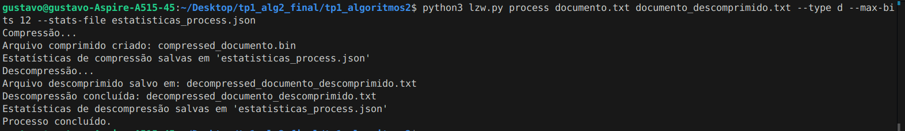

---

## Testes

### Métodos

O código foi instrumentado para monitorar os tempos de compressão e descompressão, razão de compressão, tamanho do dicionário e uso de memória. Para cada arquivo descomprimido, foi verificada a integridade a partir da comparação binária, para assegurar que os dados originais foram recuperados sem perdas.  
Tais variáveis foram avaliadas em arquivos de diferentes tipos e tamanhos, de forma a verificar o desempenho do algoritmo em diferentes cenários. Foram realizados testes com arquivos de texto (`.txt`), imagem (`.bmp`, `.pgm`), áudio (`.wav`) e binários (`.bin`).  
Outros formatos comuns de arquivos, como `.jpg`, `.png` e `.mpg`, não foram testados, pois apresentam compressão (com ou sem perdas) o que influenciaria no comportamento do programa e prejudicaria as análises.  
Um script no Google Colab (presente no repositório de entrega do trabalho) foi empregado para gerar visualizações dos testes realizados.

### Resultados e Discussão

A eficiência do algoritmo LZW é altamente dependente das características dos dados de entrada. A seguir, discutimos como diferentes fatores influenciam a taxa de compressão em textos, imagens e arquivos binários.  
A respeito das duas variantes do algoritmo, a versão dinâmica se demonstrou mais atrativa do que sua variável estática nos momentos em que os limites para tamanho de código máximo não ultrapassaram a faixa de 16 a 20 bits. O uso de tamanhos de códigos variáveis associados a uma escolha ponderada de um teto de crescimento apresentaram melhores taxas de compressão em comparação à alternativa de sempre emitir códigos de 12 bits para a maioria dos casos. Vale ressaltar que o uso de memória pode se tornar um problema caso o dicionário representado pela árvore de prefixos cresça de forma preponderante. Ademais, códigos muito extensos tendem a anular o efeito da compressão para execuções muito longas.  
Para se ter uma ideia do desempenho do LZW para os casos principais de texto (`.txt`) e de imagem (`.bmp`), o algoritmo no caso estático teve os seguintes resultados:

- O arquivo de texto “test_text.txt” com 200 mil caracteres apresentou uma redução de 200000 bytes para 59537 bytes.
- A imagem “[imagemhomog_30kb.bmp](https://github.com/gustavochavesferreira/tp1_algoritmos2/blob/main/tests/test_files/imagemhomog_30kb.bmp)” de tamanho inicial 282062 bytes se reduziu para 3417 bytes (a redundância foi bem aproveitada).

Para formatos de arquivo mais variados, algumas estatísticas obtidas estão representadas abaixo. Elas são seguidas por comentários a respeito de cada formato.

|       |                 File_Name | File_Type | Decompression_Time(s) |
| ----- | ------------------------: | --------: | --------------------: |
| **0** |      imagemhomog_30kb.bmp |    Imagem |              0.089742 |
| **1** |    textorepetido_27kb.txt |     Texto |              0.169627 |
| **2** |             cameraman.pgm |    Imagem |              5.866575 |
| **3** |             lorem_5kb.txt |     Texto |              0.427574 |
| **4** |               unequal.pgm |    Imagem |              5.266500 |
| **5** |         smallbin_10kb.bin |   Binário |              0.926233 |
| **6** | small_text_compressed.bin |   Binário |              0.006635 |
| **7** |    CantinaBand3_132kb.wav |     Áudio |             13.067423 |

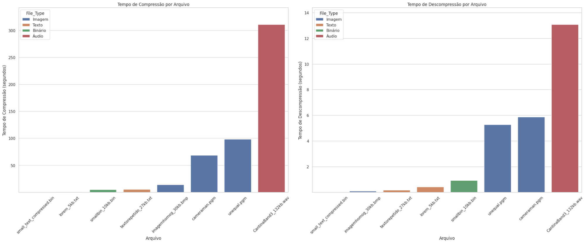

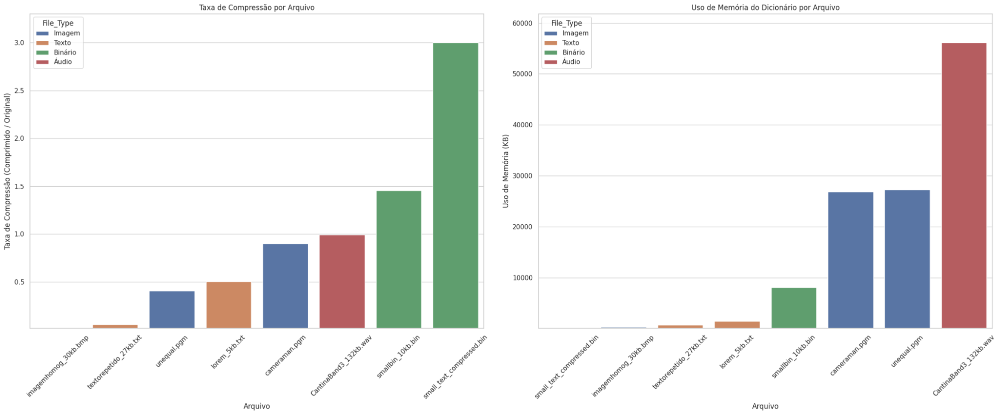

### Textos

Textos com muitas repetições, como documentos com vocabulário limitado ou formatos estruturados (como XML ou JSON), tendem a ser mais compressíveis. Isso ocorre porque o LZW aproveita sequências repetidas para construir um dicionário mais eficiente. Textos ricos em vocabulário, como obras literárias, têm menos repetições e, portanto, menor taxa de compressão.

### Imagens

Imagens com áreas grandes de cor uniforme, como gráficos ou desenhos animados, são mais compressíveis. Já imagens fotográficas, com variação de cores e detalhes finos, oferecem menos oportunidades para compressão. Imagens em escala de cinza ou monocromáticas têm menos informações por pixel do que imagens coloridas, resultando em maior taxa de compressão.  
Imagens já comprimidas em formatos como JPEG ou PNG (que usam compressão com perdas e sem perdas, respectivamente) podem não ser eficazmente comprimidas novamente pelo LZW.

### Áudios

A compressão de arquivos WAV utilizando o algoritmo LZW é influenciada principalmente pela redundância dos dados de áudio, parâmetros de gravação como taxa de amostragem e profundidade de bits, complexidade do conteúdo de áudio, e configurações do algoritmo LZW. Arquivos WAV com alta redundância e padrões repetitivos são mais eficazmente comprimidos pelo LZW, enquanto aqueles com alta entropia e variações rápidas apresentarão menores taxas de compressão.

### Arquivos Binários

Arquivos binários com dados aleatórios ou já comprimidos (como arquivos ZIP ou executáveis) possuem alta entropia, o que torna a compressão adicional ineficiente. Se o arquivo binário contém estruturas repetitivas ou padrões previsíveis, o LZW pode obter alguma compressão. Arquivos binários que representam dados estruturados (por exemplo, registros com campos fixos) podem ser mais suscetíveis à compressão.

### Outras Análises

Observa-se que a taxa de compressão tende a estabilizar conforme o dicionário cresce e o algoritmo encontra sequências repetidas mais longas. Em arquivos com alta redundância, a taxa de compressão inicial é mais acentuada. O crescimento do dicionário é mais rápido em arquivos com muitos padrões únicos, o que pode afetar o desempenho em termos de memória.

| 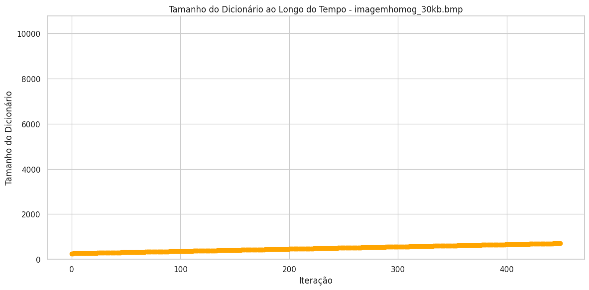 | 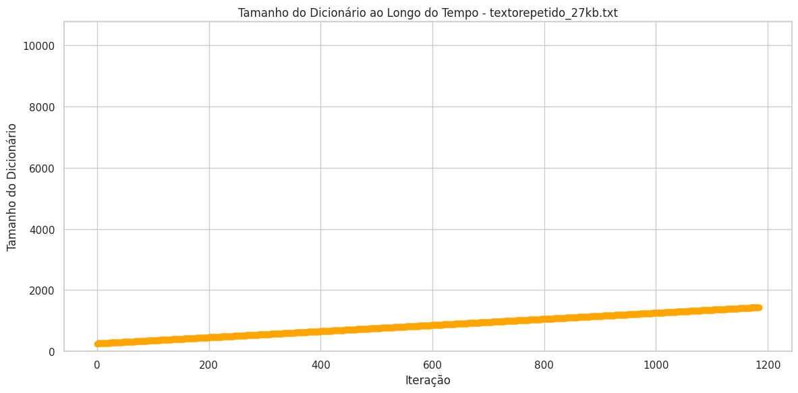 |
| :------------------------ | :------------------------ |
| 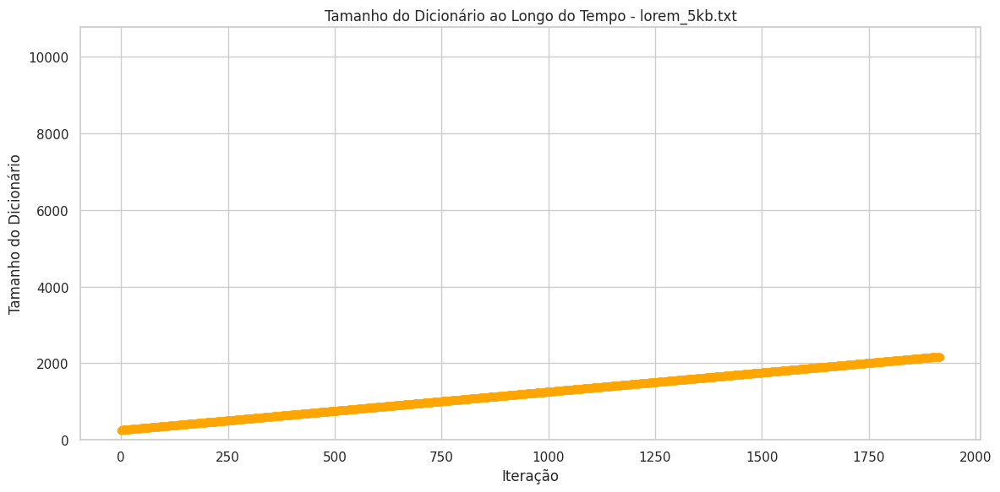 | 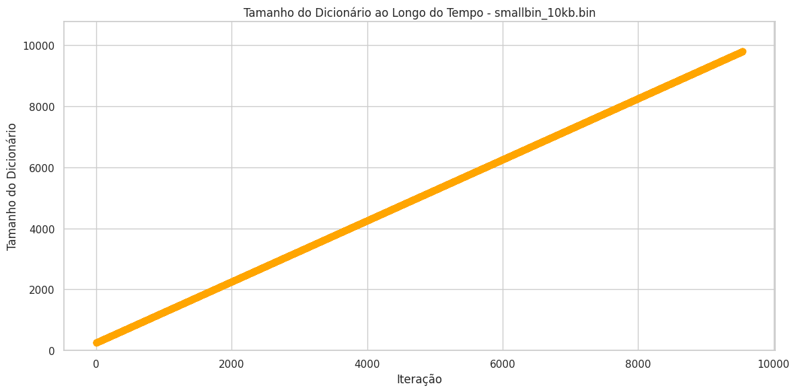 |

| 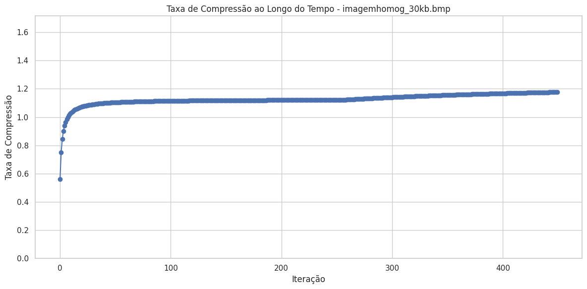  | 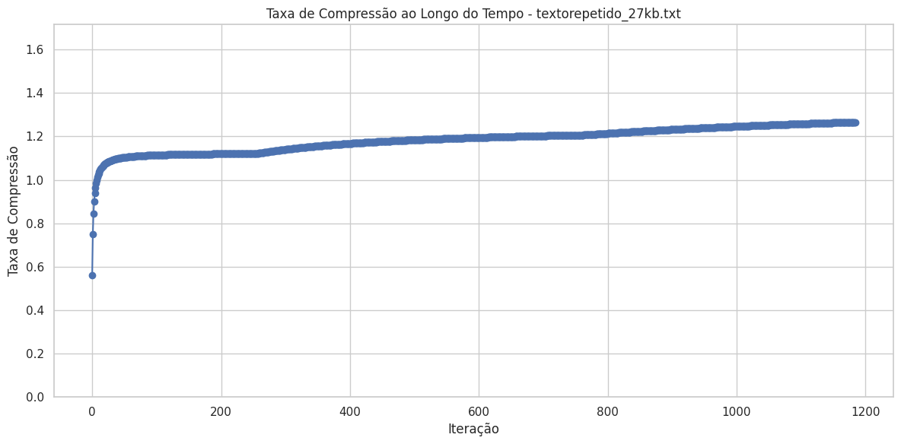  |
| :------------------------- | :------------------------- |
| 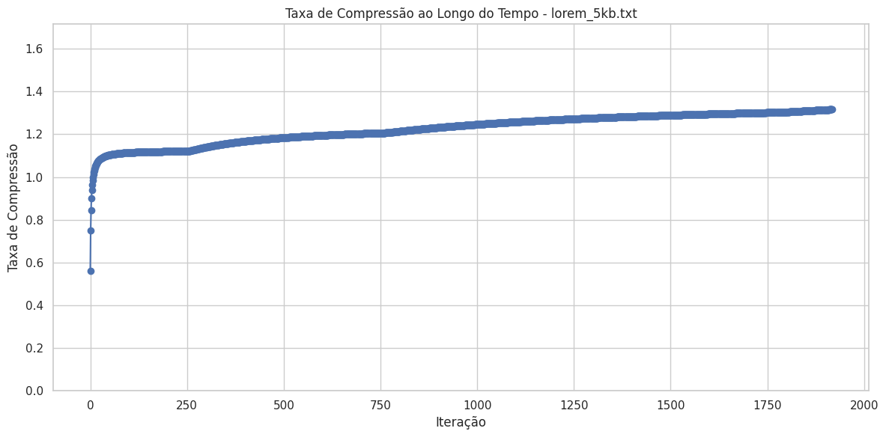 | 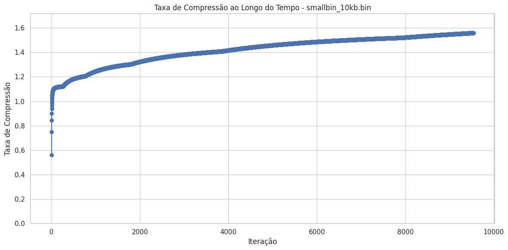 |

---

## Conclusão

A implementação do algoritmo LZW utilizando uma trie compacta demonstrou-se eficaz na compressão de arquivos de diferentes tipos. A estrutura de dados escolhida permitiu otimizar as operações críticas do algoritmo, resultando em tempos de execução aceitáveis e uso de memória controlado.  
Os testes realizados confirmaram a correta funcionalidade do algoritmo, preservando a integridade dos dados após a compressão e descompressão. Observou-se que a eficiência da compressão varia conforme o tipo de arquivo e suas características intrínsecas, sendo mais eficaz em dados com alta redundância.  
Enquanto métodos como o LZW oferecem uma base sólida e flexibilidade, o avanço contínuo na tecnologia de compressão tem permitido o desenvolvimento de soluções mais especializadas e eficientes para domínios específicos. Assim, a escolha informada do método de compressão não apenas maximiza a eficiência do armazenamento, mas também preserva a integridade e qualidade dos dados de maneira mais eficaz.

---

## Referências

- Lempel, A., Ziv, J. Compression of Individual Sequences via Variable-Rate Coding. IEEE Transactions on Information Theory, 1978.
- [https://www2.cs.uic.edu/~i101/SoundFiles/](https://www2.cs.uic.edu/~i101/SoundFiles/)
- [https://web.mit.edu/6.02/www/s2012/handouts/3.pdf](https://web.mit.edu/6.02/www/s2012/handouts/3.pdf)
- [https://www.davidsalomon.name/DC4advertis/DComp4Ad.html](https://www.davidsalomon.name/DC4advertis/DComp4Ad.html)

---

## Anexos

- **Código Fonte:** Disponível neste link do GitHub.
- **Estatísticas Detalhadas:** Os arquivos utilizados nos testes e JSON com dados completos das execuções estão disponíveis na pasta `/tests`.
